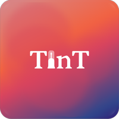
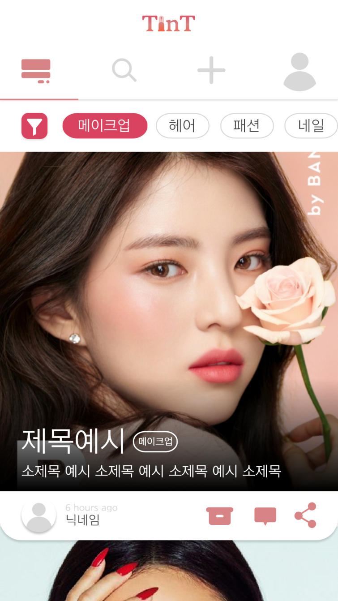
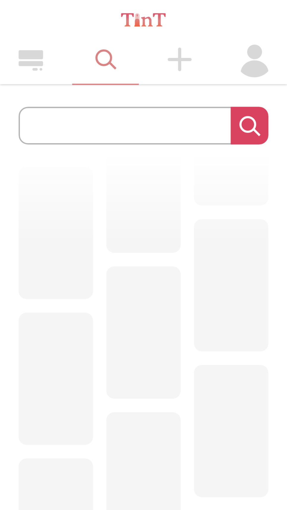
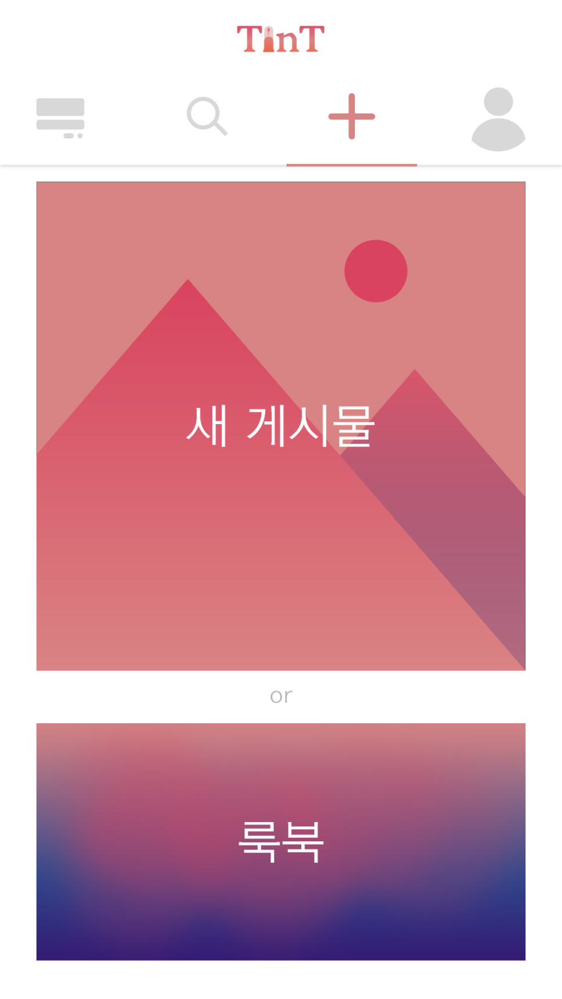
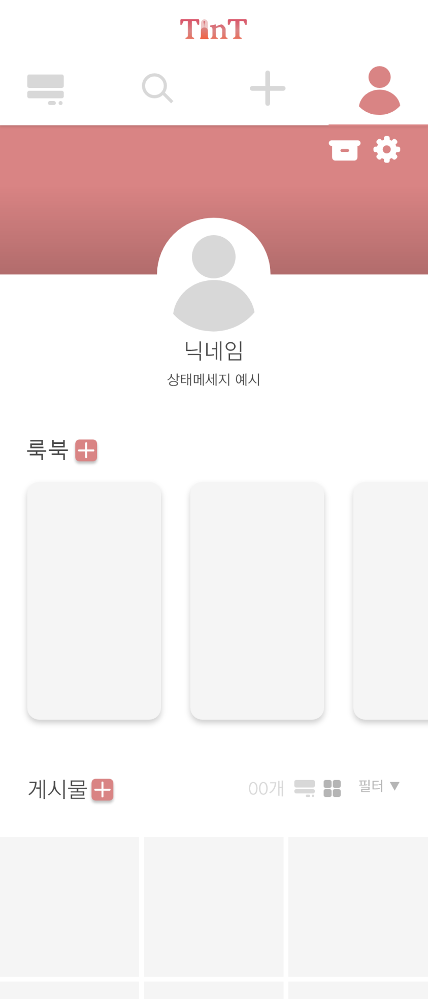

# TinT💄

- 블로그: https://blog.naver.com/jhs030526/222250549683
- 개발 언어: `Java`
- 개발 기간: `2020.11` ~ `2020.12` (약 2달)

|          피드탭           |            검색탭             |            추가탭             |            프로필탭             |
| :-----------------------: | :---------------------------: | :---------------------------: | :-----------------------------: |
|  |  |  |  |

### 시연연상 / Demo Video

https://youtu.be/1u4maw2Al7Y

### 프로젝트 소개 / Introduction

사진과 글이 담긴 게시물을 올려 자신의 스타일 및 뷰티 정보를 기록하거나 공유할 수 있는 SNS 형식의 앱으로, 교내대회에 제출하여 본선에 진출하였습니다. 저는 이 프로젝트에서 로그인 기능, 포스트 업로드 기능, 유저 관리 기능 개발 등 앱과 백엔드(파이어베이스)를 연결하는 역할을 맡았습니다.

앱에서 올릴 수 있는 게시물에는 포스트와 룩북이 있습니다. 포스트는 사진, 글은 물론 카테고리를 설정할 수 있고, 룩북은 사진 한 장에 자신이 올린 포스트들을 연결하는 구조로 설계했습니다.
